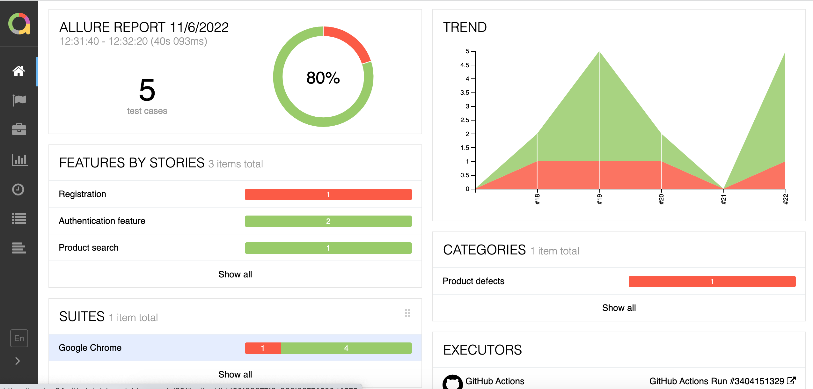
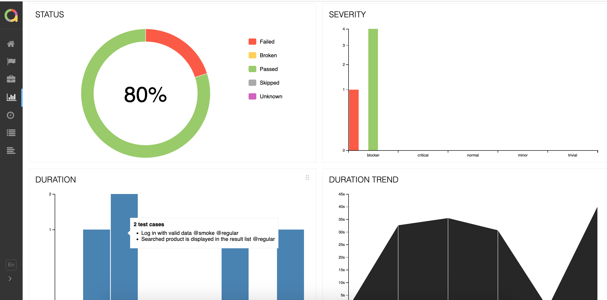

## Description

The project goal is to learn and practice new tools and create an example of a test automation framework for writing automated tests.

The tools are used:
* [Typescript](https://www.typescriptlang.org/) is a strongly typed programming language that builds on JavaScript
* [Playwright](https://playwright.dev/) is a test automation tool to perform end-to-end testing
* [Allure Report](http://allure.qatools.ru) is a test results report used to visualize the results of a test run after it has been completed 

## UI Tests

:heavy_check_mark: Log in with invalid data    
:heavy_check_mark: Log in with valid data    
:heavy_check_mark: User is able to register a new account with valid data    
:heavy_check_mark: Searched product is displayed in the result list  
:heavy_check_mark: The result list is empty if product doesn't exist

## Launch the tests

### Run all the tests:
```npx playwright test```</br>

### Run tests by a tag:
```npx playwright test --grep @tag_name```

## Allure Report results

#### Note:
You might need to install allure on your local machine

### Generate Allure Report:
```allure generate allure-results -o allure-report --clean```

### Open Allure Report:
```allure open allure-report```

## Allure report: Screenshot example 1


## Allure report: Screenshot example 2
